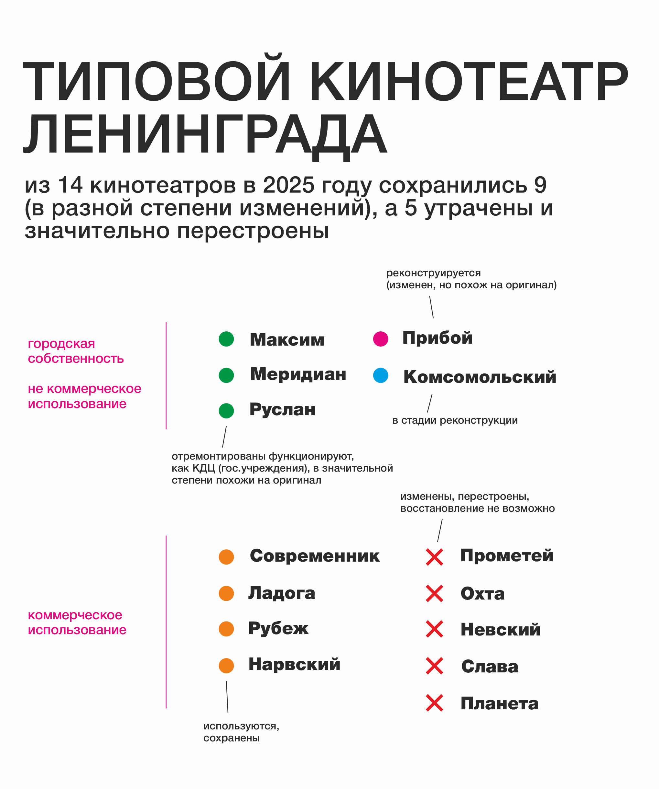
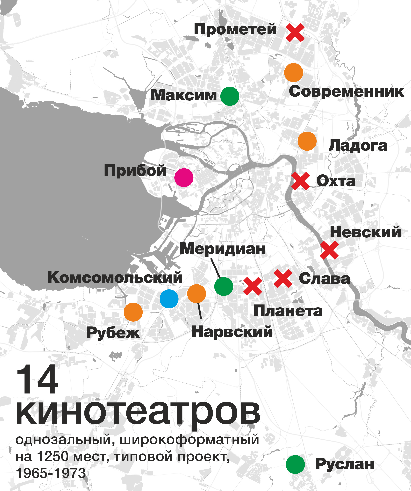
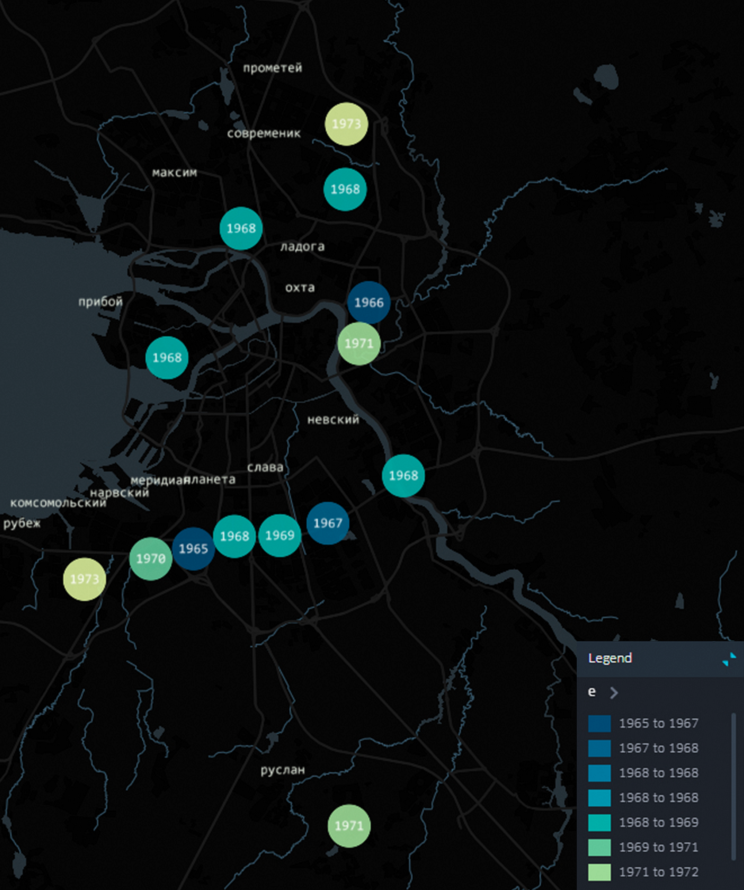

# L-UDI

Проект N1013 лаборатории L+UDI (ИТМО ИДУ) «Исследование актуальных градостроительных проблем и проблем городской среды».

* Кина не будет! - сказал джентльмен удачи Косой.

Рисунок 1. «Кина не будет!» — обложка визуальной заметки.

Отдельно стоящее здание кинотеатра - центра культурной жизни советского человека, центра «важнейшего» из искусств ленинградца, в Санкт-Петербурге в 2025 году еще можно найти.

Рассвет строительства больших, районных,  однозальных широкоформатных кинотеатров вместимостью 1250 зрителей был в конце 60-х ХХ века. Для жителей типовое здание кинотеатра с выгнутым дугой остекленным фасадом было характерной приметой ленинградских новостроек на протяжении почти 25-ти лет. Проект под шифром 2ЛГ-06-1 был разработан в 1963 году и построен в городе 14 раз.

Рисунок 2. Карта: 14 кинотеатров типового проекта 2ЛГ-06-1 (расположение и статус).

По этому же проекту были построены кинотеатры «Россия» в Ижевске и «Октябрь» в Орджоникидзе (теперь Владикавказ).

Фасад кинотеатра служил говорящим символом - это общественное учреждение, а изогнутая дуга была подобна панорамному экрану. За стеклянным обрамлением находились фойе, кассы, вестибюли и зоны ожидания сеанса. Сам же зрительный зал с балконом, рассчитанный на 1250 мест, был заключен в прямоугольную кирпичную коробку, верхняя часть которой возвышалась в центре здания — к ней обычно монтировали название кинотеатра.

Проект был разработан коллективом авторов 2-й мастерской института Ленпроект (сейчас ОАО «ЛЕННИИПРОЕКТ») под руководством архитектора Виктора Белова. В его команду вошли Олег Василенко, Натан Трегубов, Людвиг Шимаковский и Виктор Фромзель. Первым кинотеатром, построенным по этому проекту, стал «Нарвский» — на бульваре Новаторов. К его возведению приступили в августе 1964 года, а в самом конце 1965 года с оценкой «хорошо» его приняла Госкомиссия. Правда, она отметила ряд неудовлетворительных проектных решений, в частности крыши: на ней возникали «снеговые мешки». Эти замечания впоследствии были частично учтены.

Рисунок 3. Годы ввода в эксплуатацию (1965–1973).

О преимуществах же проекта сам архитектор Виктор Белов сообщал в интервью газете «Строительный рабочий» от 28 сентября 1965 года: В новом зале зрители смогут смотреть и обычные, и широкоэкранные, и широкоформатные фильмы. Эффективна система движения зрителей — в прежних кинотеатрах для того, чтобы выбраться из зала на улицу, затрачивали 5 – 10 минут, в этом же уходит не более минуты. А это не только удобно, но имеет и экономический эффект, позволяет организовать каждый день еще один сеанс.
Ширина прохода между рядами — 95 сантиметров, не придется вставать, чтобы пропустить проходящего человека.

Архитектурный облик кинотеатра вызвал исключительно положительные отклики современников. Вот что писала архитектор Ирина Дуранина в 1972 году в специализированном обзоре «Кинотеатры и  киноконцертные залы современного Ленинграда»: - Объемно-планировочная композиция удачна. Удобная и экономичная система заполнения и эвакуации зрительного зала. Прозрачное стекло сверху донизу как бы разрушает преграду между вестибюлем, фойе и площадью, вводит жизнь улицы в интерьер кинотеатра. Эта иллюзия подчеркивает общественный и зрелищный характер сооружения. Особенно эффектно «Нарвский» выглядел на фоне типовых жилых домов. Вечером освещенный изнутри фасад как будто бы манил к себе.

Любопытна история названий этих кинотеатров. Их утверждал Ленгорисполком на основе предложений, присылаемых по почте жителями, мнения сотрудников Музея истории города, а также результатов обсуждения городской Топонимической комиссии. «Прибой» на Васильевском острове обыгрывал приморскую тематику, а «Меридиан» напоминал о проходящем поблизости Пулковском меридиане.
Наименование «Максим» было связано с популярной киносагой 1930-х годов. Но самое главное, что герой фильма рабочий-революционер Максим был представителем пролетариата Выборгской стороны, а именно к ней исторически относился район Ланского шоссе, где находился кинотеатр.

Сегодня пять из четырнадцати кинотеатров снесены: «Охта», «Невский», «Планета», «Прометей» и «Прибой». На месте снесенной «Охты» построили здание театра «Буфф», которое своим стеклянным, и также вытянутым дугой, фасадом как бы отсылает к стоявшему здесь прежде кинотеатру. И, что немаловажно, — память места! — перед театром «Буфф» оставлен сквер.

Рисунок 4. Текущий статус объектов (2025): сохранены, коммерческое/некоммерческое использование, утрачены.

В шести разместились торговые заведения и фитнес-клубы, в том числе и в первенце — «Нарвском». В двух кинотеатрах остались учреждения культуры: в бывших «Меридиане» и «Руслане» ныне действуют дома молодежи. Культурно- досуговый центр с концертным залом на 800 мест появится и в «Максиме». Его ремонт, начатый еще в 2011 году, завершен в 2021. Причина того, что ни один из прежних типовых кинотеатров не действует по своему первоначальному назначению, хорошо всем известна: в сегодняшних рыночных условиях один большой зал - экономически неэффективен. Кинопрокатные организации уже давно сделали ставку на многозальные кинотеатры в торговых комплексах. Но несмотря на это месторасположение объекта досугового назначения советского периода, определенное в микрорайонной планировке, осталось в основном без изменения, сегодня современные функции бывших кинотеатров, также направлены на потребности досуга, массовых мероприятий и развлечений.

И даже если «Кина не будет!», то планировочные решения и объемную композицию широкоформатного кинотеатра Ленинградского модернизма в 2025 году еще можно увидеть. На схеме мы указали все 14 кинотеатров на территории Санкт-Петербурга.

18.03.2025
