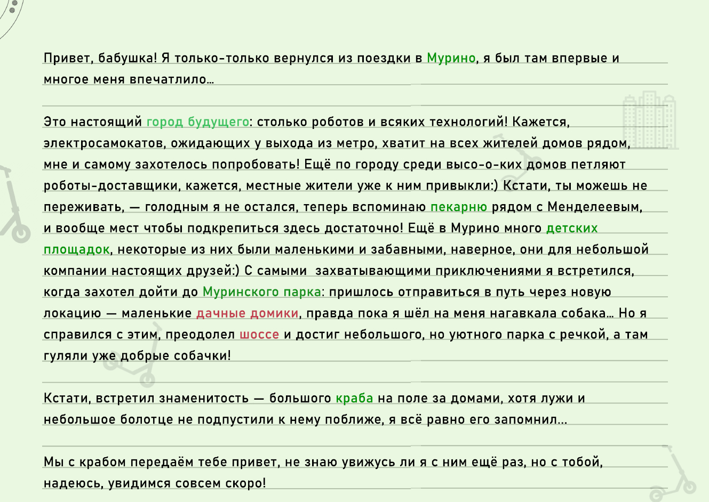
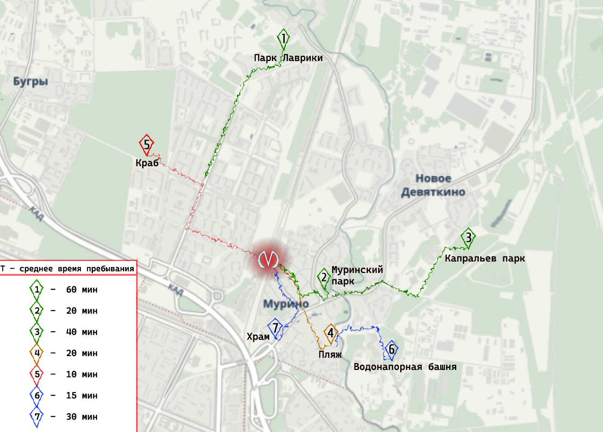
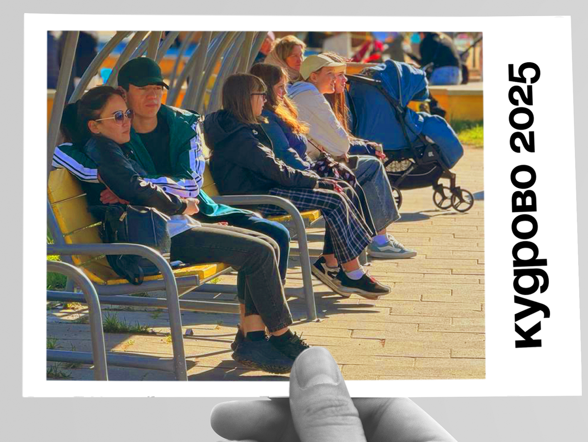

# L-UDI

Проект N1014 лаборатории L+UDI (ИТМО ИДУ) «Исследование актуальных градостроительных проблем и проблем городской среды».

Каникулы в Мурино, Кудрово
Каникулы в новых городах Мурино и Кудрово.
Рядом с Петербургом возникли новые города. Красивый, молодой, полный энергии и построен без всех известных градостроительных проблем – так мы представляем себе Новый город и поэтому мы проведем каникулы в этих городах.
Одна группа молодых урбанистов отправилась нво время майских каникул в выходной день в Мурино, а другая в Кудрово. Они, как путешественники должны быть посмотреть достопримечательности, отдохнуть, узнать что-то новое и набраться впечатлений. Результатом такого путешествия должна была стать открытка, небольшое послание свое знакомому из этого города. И вот что получилось.
Отправиться в путешествие мы должны без предварительной подготовки, как есть – сорваться и укатить на каникулы в Мурино (Кудрово) – вот такая задача стояла перед путешественником. Во время поездки надо написать открытку с впечатлениями и восстановить маршрут после поездки в виде карты.

📩Открытка из Мурино.
Привет, бабушка! Я только-только вернулся из поездки в Мурино, я был там впервые и многое меня впечатлило... Это настоящий город будущего: столько роботов и всяких технологий! Кажется, электросамокатов, ожидающих у выхода из метро, хватит на всех жителей домов рядом, мне и самому захотелось попробовать! Ещё по городу среди высо-о-ких домов петляют роботы-доставщики, кажется, местные жители уже к ним привыкли:) Кстати, ты можешь не переживать, — голодным я не остался, теперь вспоминаю рядом с Менделеевым, и вообще мест чтобы подкрепиться здесь достаточно! Ещё в Мурино много детских площадок, некоторые из них были маленькими и забавными, наверное, они для небольшой компании настоящих друзей😊 С самыми захватывающими приключениями я встретился, когда захотел дойти до Муринского парка: пришлось отправиться в путь через новую локацию — маленькие дачные домики, правда пока я шёл на меня нагавкала собака... Но я справился с этим, преодолел и достиг небольшого, но уютного парка с речкой, а там гуляли уже добрые собачки! Кстати, встретил знаменитость — большого на поле за домами, хотя лужи и небольшое болотце не подпустили к нему поближе, я всё равно его запомнил... Мы с крабом передаём тебе привет, не знаю увижусь ли я с ним ещё раз, но с тобой, надеюсь, увидимся совсем скоро!
Твой любящий внук Андрей.

Рисунок 2. Открытка из Мурино.

Рисунок 3. Карта из Мурино.

Рисунок 1. Открытка из Мурино. На фото местные жители.
📩Открытка из Кудрово.
Саша привет! Пишу из Кудрово. Это новый город рядом с Санкт-Петербургом. Это удивительно, что можно оказаться в другом городе перешагнув невидимую границу через ветку железной дороги. Так быстро и пешком оказаться в другом городе это – невероятно 😊 Меня поразили люди - жизнерадостные, открытые, веселые и дружелюбные. После небольшого перекуса, полдень я сидела на солнечной стороне, на скамейке в парке Мега и болтала  с местными жителями о том, что посмотреть и что интересного есть в Кудрово. Очень энергично люди рассказывали о красивом и удобном парке, о том, как хорошо здесь жить. Парк действительно очень хороший. Пусть здесь нет музея или театра или исторических зданий, как мы привыкли в Питере 😊, но все равно здесь можно посмотреть современную архитектуру и интересное благоустройство.  Я все нарисовала и сделала карту моего путешествия.
Cмотри TG.

Стоит отметить, что впечатления и эмоции «неподготовленного» и «отстранённого, от проблем городской среды» человека в Мурино и Кудрово оказались позитивными, более того короткие разговоры и показали, что для туриста, путешественника или гостя создаются местными жителями благоприятная атмосфера, жители готовы рассказывать и показывать город с хорошей стороны.

25.05.2025
