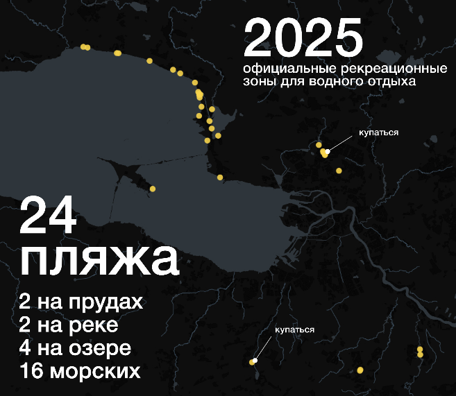
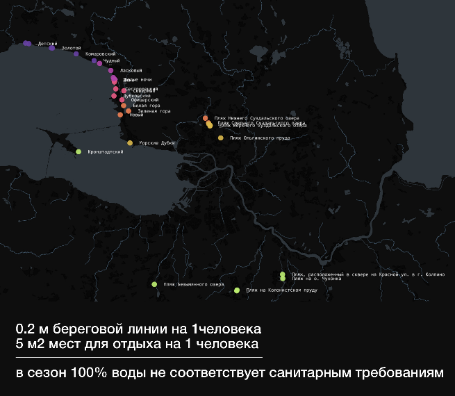
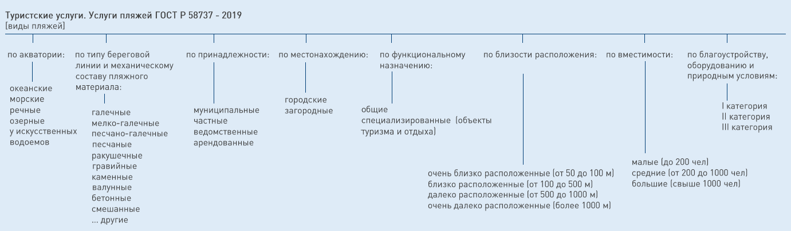
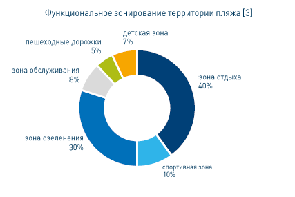
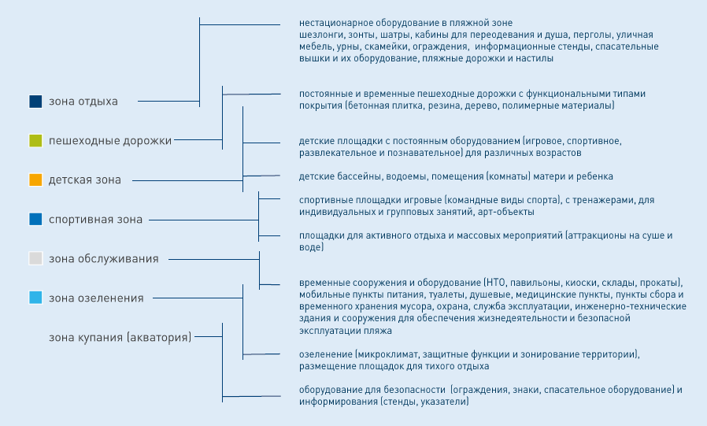
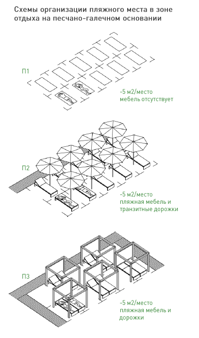
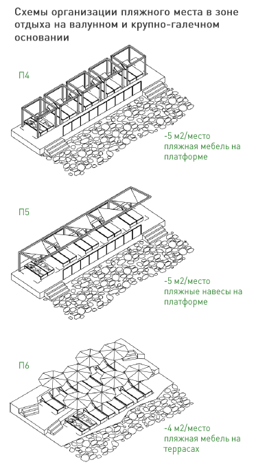

# L-UDI

Проект N1015 лаборатории L+UDI (ИТМО ИДУ) «Исследование актуальных градостроительных проблем и проблем городской среды».

Пляжи Санкт-Петербурга

После защиты одной из научно-исследовательской работы магистранта ИДУ по теме сохранения исторического наследия, возникла дискуссия на тему процесса подготовки историко-культурной экспертизы (ИКЭ) для обоснования и принятия проектных решений, а также последующей реставрации. Какое количество экспертиз возможно провести в год?  Можно ли определить динамику работ по сохранению ОКН? Какое количество экспертов работает в стране?  В регионе?

Начнем с 2010 года, когда вышел приказ Министерства Культуры от 26 августа 2010 г. N 563 «Об утверждении положения о порядке аттестации экспертов по проведению государственной историко-культурной экспертизы» и именно тогда поиск эксперта для проекта был осложнен их небольшим количеством, так например в 2013 году аттестованных экспертов было около 50 человек на всю страну.
Следующее потрясение в количестве экспертов произошло в 2021 году, с выходом новой редакции Приказа и как следствие обновление списка аттестованных лиц. С мая 2025 года действует новый приказ Минкульта об процедуре аттестации экспертов.

Реестр сертифицированных (аттестованных) экспертов ведется с 2016 года и на основе наборов данных Министерства культуры <https://opendata.mkrf.ru/opendata/7705851331-certified\_experts> можно посмотреть не только количество, но и проследить динамику количества специалистов по стране и регионам.

Эти наборы содержат персональную информацию, поэтому файлы не публикуем, а вот где находятся эксперты и их количество, а также динамика сертификации экспертов ИКЭ - в инфографике на открытых данных.

|  |  |
|--------------------------------|--------------------------------|

Рисунок 1. Общее количество пляжей в Санкт-Петербурге.

Требования по устройству и эксплуатации пляжей приведены в ГОСТ Р 55698-2013 «Туристские услуги. Услуги пляжей», а также НПА в сфере проектирования, строительства, обеспечению безопасности, охраны окружающей среды, санитарно-эпидемиологического благополучия человека, охраны труда.

Рекомендации в части функционального зонирования приведены в НПА в качестве информационных материалов и могут быть изменены с учетом проектных решения, местных или региональных норм проектирования.

На сегодня практика проектирования и в том числе, составление функциональной программы пляжа базируется на проведенной предпроектной, исследовательской и изыскательской работе, а также полученных исходных данных о территории, с последующим составление подробного технического задания заказчиком проекта пляжа.

Рисунок 2. Функциональное зонирование морского пляжа.

Расчетные показатели для определения вместимости и размеров территории пляжей:

1. Размер территории морского пляжа – 5 м2 на одного посетителя \[1].
2. Минимальная протяженность береговой полосы для морских пляжей 0.2 м на одного посетителя \[1].
3. Коэффициент единовременной загрузки посетителями пляжей общего пользования для местного населения – 0.2, посетителями учреждениями туризма и отдыха – 0.9 \[1].

|  |  |
|--------------------------------|--------------------------------|

\[1] - СП 42.13330.2016 «Градостроительство. Планировка и застройка городских и сельских поселений»
\[3] – ГОСТР 55698-2013 «Туристские услуги. Услуги пляжей»

.

20.06.2025
