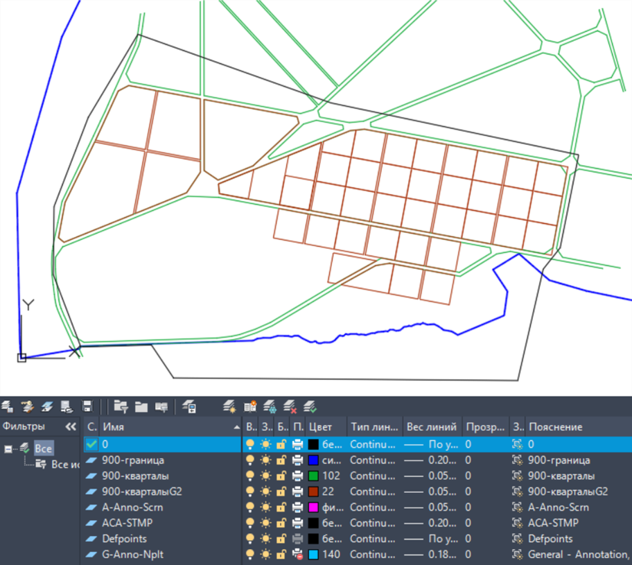

# L-UDI

Проект N1017 лаборатории L+UDI (ИТМО ИДУ) «Исследование актуальных градостроительных проблем и проблем городской среды».

Лаборатории была поставлена задача разработчика цифровой платформы «Простор» (разрабатывается в ИДУ ИТМО) подготовки варианта застройки для нового района города, альтернативного варианта. Такой вариант должен быть подготовлен под руководством градостроителя, отражать авторское видение, соответствовать нормам и ограничениям в области градостроительства и проектные решения не должные противоречить существующей документации по территориальному планированию и градостроительному зонированию.
В рамках разработки такого проекта были собраны исходные данные по территории, градостроительная документация в виде генерального плана и правил землепользования и застройки г. Шлиссельбург.

Вся исходная документация была получена из официальных источником (ФГИС ТП)  и в актуальном редакции на июнь 2025 года. Дополнительно была собрана информация о планируемых проектах на выбранной территории. Также были использованы «Стандарты комплексного развития территорий» - регламенты дом.рф.
Работа была выполнена следующим этапам:

* анализ исходных данных, законодательства и нормативной документации;
* концептуальное планировочное решение, эскиз застройки (создается градостроителем – экспертом);
* выполнение чертежа (векторный файл в формате \*.dxf, \*.geojson);
* передача файла (корректировка слоев и привязка координат проекта).
  

Рисунок 1. Чертеж застройки территории г. Шлиссельбург.
Вся разработанные материалы в виде векторных файлов были переданы разработчикам платформы «Простор».

28.06.2025
